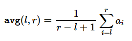

# A. Beautiful Average

**Time limit per test:** 1 second  
**Memory limit per test:** 256 megabytes  

---

## 🧮 Problem Statement

You are given an array **a** of length **n**.

Your task is to find the **maximum possible average value** of any subarray of the array **a**.

Formally, for any indices **l**, **r** such that `1 ≤ l ≤ r ≤ n`, define the average of the subarray  
`aₗ, aₗ₊₁, …, aᵣ` as the sum of elements divided by the number of elements:

<p align="center">
  
</p>

Output the **maximum value** of `avg(l, r)` over all choices of `l, r`.

---

### 📘 Note

> A subarray **b** is a subarray of an array **a** if **b** can be obtained from **a** by deleting several (possibly zero or all) elements from the beginning and several (possibly zero or all) elements from the end.  
> In particular, an array is a subarray of itself.

---

## 🧩 Input

- The first line contains a single integer **t** (`1 ≤ t ≤ 10⁴`) — the number of test cases.  
- The first line of each test case contains a single integer **n** (`1 ≤ n ≤ 10`) — the length of the array **a**.  
- The second line of each test case contains **n** integers `a₁, a₂, …, aₙ` (`1 ≤ aᵢ ≤ 10`) — the elements of the array.

---

## 📤 Output

For each test case, output a single integer — the **maximum average** of any subarray of the given array.

It can be shown that the answer is always an integer.

---
## 🧾 Example

### **Input**

```bash
3
4
3 3 3 3
5
7 1 6 9 9
5
3 4 4 4 3
```
### **Output**

```bash
3
9
4
```

✅ **Explanation:**
- For the first test case `[3, 3, 3, 3]`, the average of all subarrays is `3`.  
- For the second test case `[7, 1, 6, 9, 9]`, the maximum average comes from subarray `[9]`, so `9`.  
- For the third test case `[3, 4, 4, 4, 3]`, the maximum average is `4`.

--------------------------------------------------------------------------

# 🧮 Maximum Element Finder

This program processes multiple test cases, where each test case consists of an array of integers.  
For every array, the program finds and prints the **maximum element**.

---

## 💡 Solution Approach

1. **Input Handling:**
   - First, read the number of test cases `t`.
   - For each test case:
     - Read an integer `n` — the size of the array.
     - Read `n` integers into a vector `ar`.

2. **Finding the Maximum:**
   - Use the STL function `max_element()` to find the largest element in the vector in **O(n)** time.

3. **Output:**
   - Print the maximum element for each test case on a new line.

---


